# NITT Examination Portal System

## Introduction
The NITT Examination Portal is a comprehensive web-based application designed to streamline the examination process for National Institute of Technology, Trichy (NITT). This system provides three distinct interfaces catering to administrators, teachers, and students, facilitating a complete digital examination ecosystem. Built with modern web technologies, the portal ensures secure, efficient, and user-friendly management of all examination-related activities.

## Theoretical Framework

### System Overview
The examination portal operates on a role-based access control (RBAC) model with the following hierarchy:
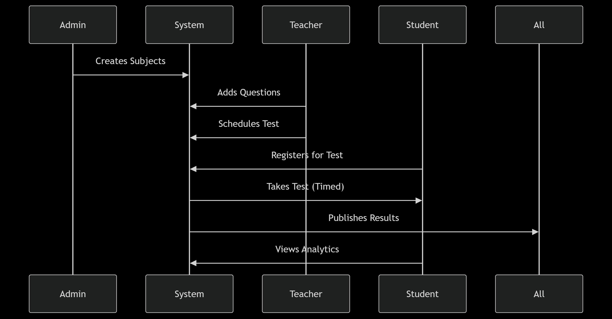

1. **Administrators**: Have supreme control over the system
2. **Teachers**: Can create and manage examinations
3. **Students**: Can take examinations and view results

### Core Concepts Implemented
- **Digital Examination Management**: Complete lifecycle from question creation to result publication
- **Time-bound Testing**: Strict time enforcement for fair examinations
- **Automated Evaluation**: Immediate result calculation for objective questions
- **Performance Analytics**: Detailed insights for both students and faculty
- **Secure Access Control**: Role-based authentication for all operations

## System Architecture

### Frontend Structure
# NITT Examination Portal

## Conceptual Architecture

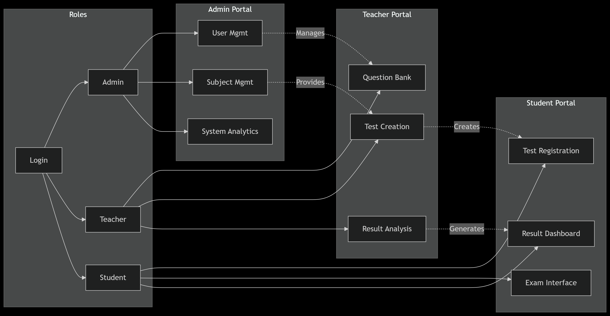

## Detailed Feature Explanation

### 1. Admin Portal
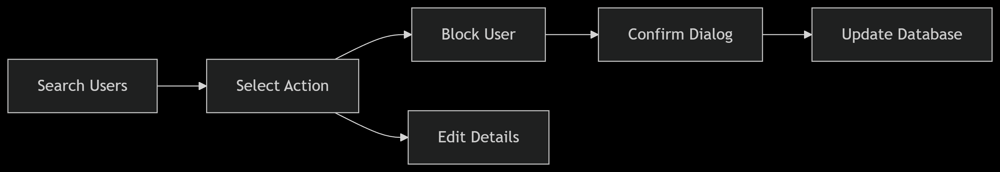
**User Management Module**
- Complete CRUD operations for user accounts
- Bulk import/export functionality
- Account status monitoring (active/blocked)
  
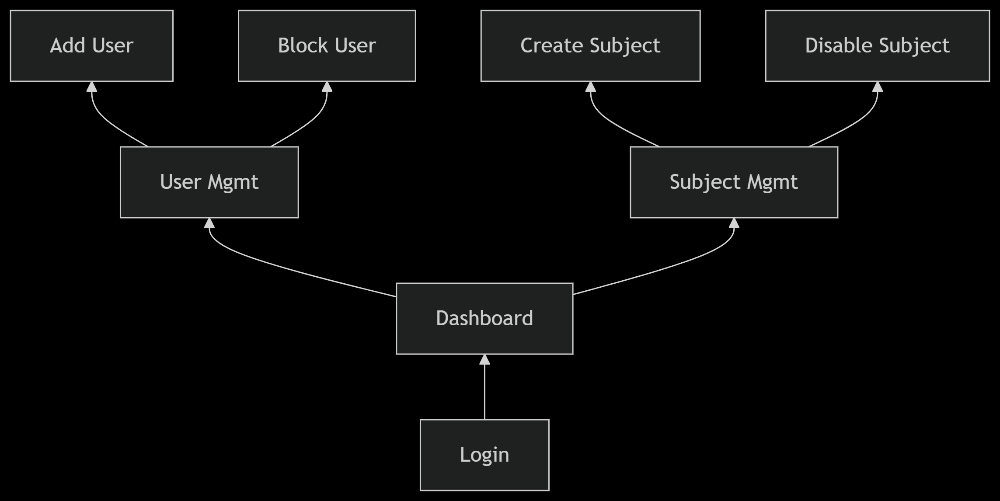

**Subject Management**
- Subject creation with metadata (code, name, credits)
- Teacher-subject assignment system
- Subject archival instead of deletion

### 2. Teacher Portal

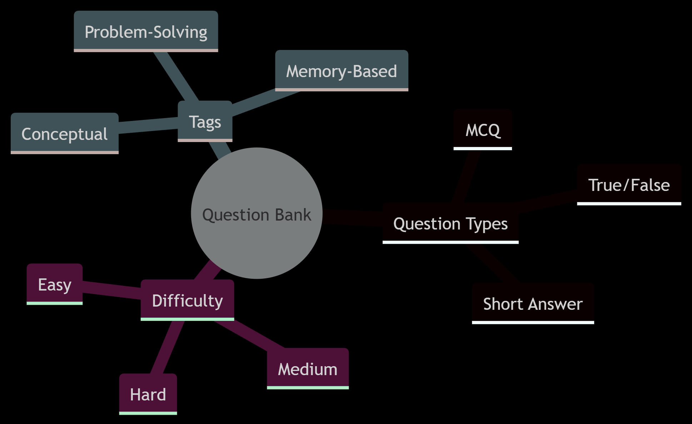
**Question Bank System**
- Support for multiple question types:
  - Multiple Choice (Single/Multi-select)
  - True/False
  - Short Answer
  - Matching Type
- Question tagging system:
  - By difficulty level
  - By topic/subtopic
  - By Bloom's taxonomy level

**Test Creation Workflow**
1. Test metadata definition (title, duration, instructions)
2. Question selection interface with filters
3. Marking scheme configuration
4. Scheduling and publishing

### 3. Student Portal

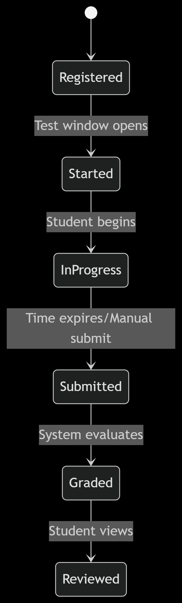

**Examination Process**
1. Test registration with deadline enforcement
2. Pre-test checklist verification
3. Timed examination interface with:
   - Question navigation panel
   - Time remaining display
   - Answer flagging system
4. Auto-submission at time expiration

**Result Analysis**
- Score breakdown by section
- Correct/incorrect answer review
- Percentile ranking
- Historical performance trends

## Technology Stack

### Frontend
| Component | Technology | Purpose |
|-----------|------------|---------|
| UI Framework | React.js | Component-based architecture |
| Styling | @emotion/react | CSS-in-JS solution |
| Component Library | @mui/material | Pre-built UI components |
| State Management | React Context | Global state management |
| Routing | React Router | Navigation and routing |

### Backend (Suggested)
| Component | Technology | Purpose |
|-----------|------------|---------|
| Runtime | Node.js | JavaScript server environment |
| Framework | Express.js | Web application framework |
| Database | MongoDB | NoSQL data storage |
| Authentication | JWT | Secure user authentication |

# WEBSITE OVERVIEW
## SYSTEM ADMIN
### Admin login

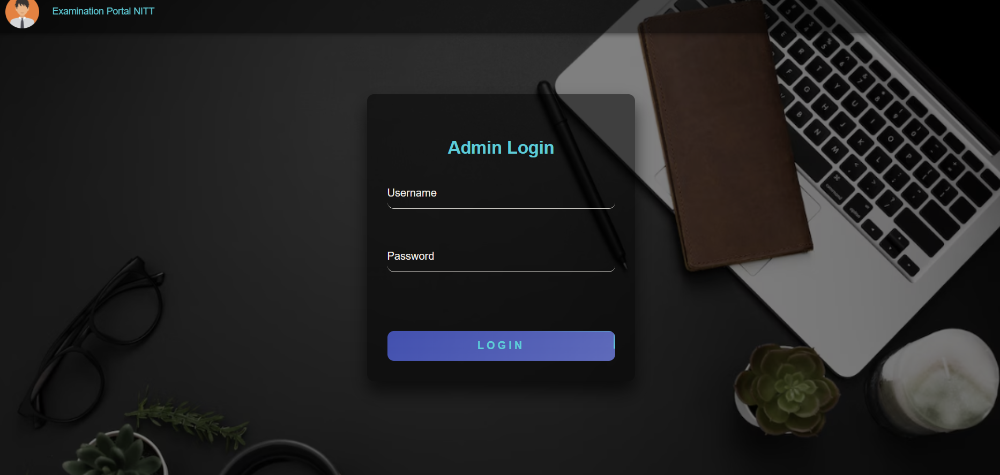

### Admin Dashboard

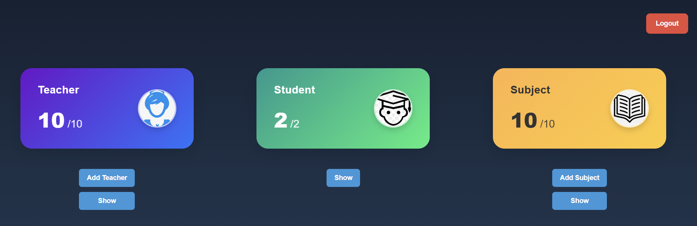

### Add teacher

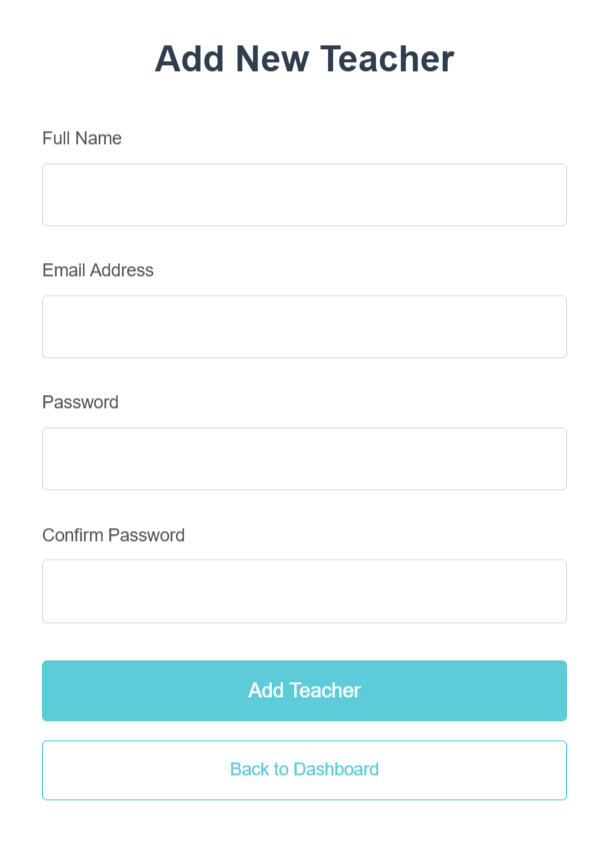

### Add Subject
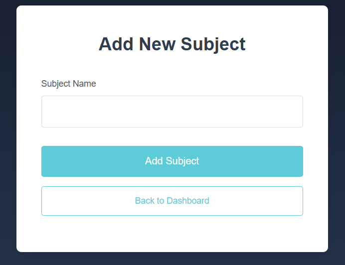

### All Subject

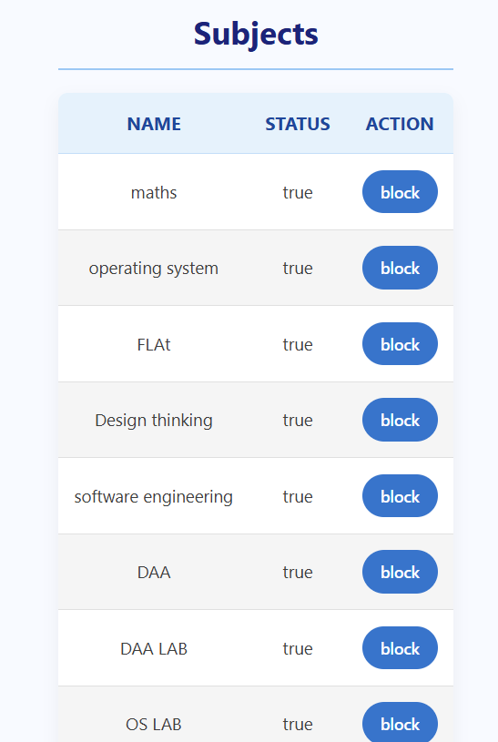

### User Login

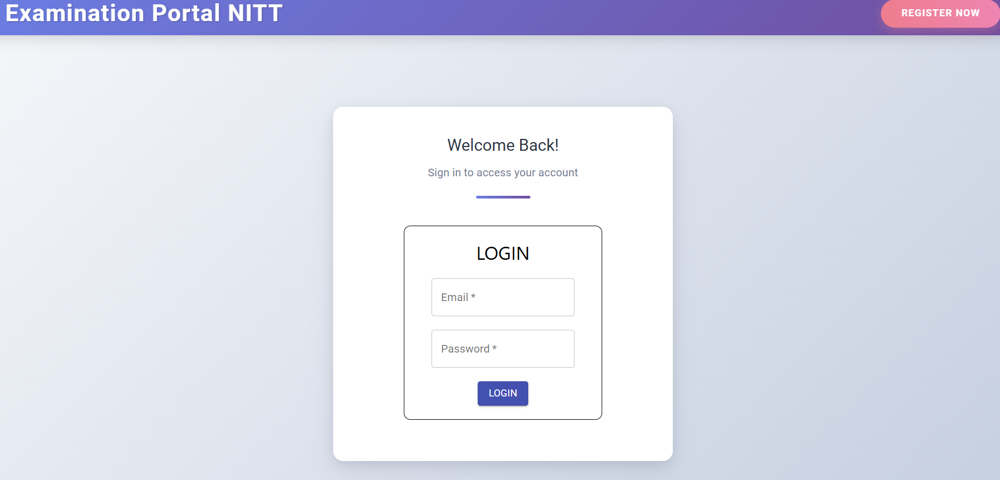

### Teacher Dashboard
 
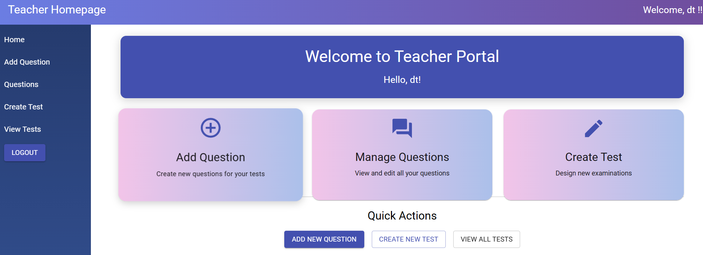

### Add Question

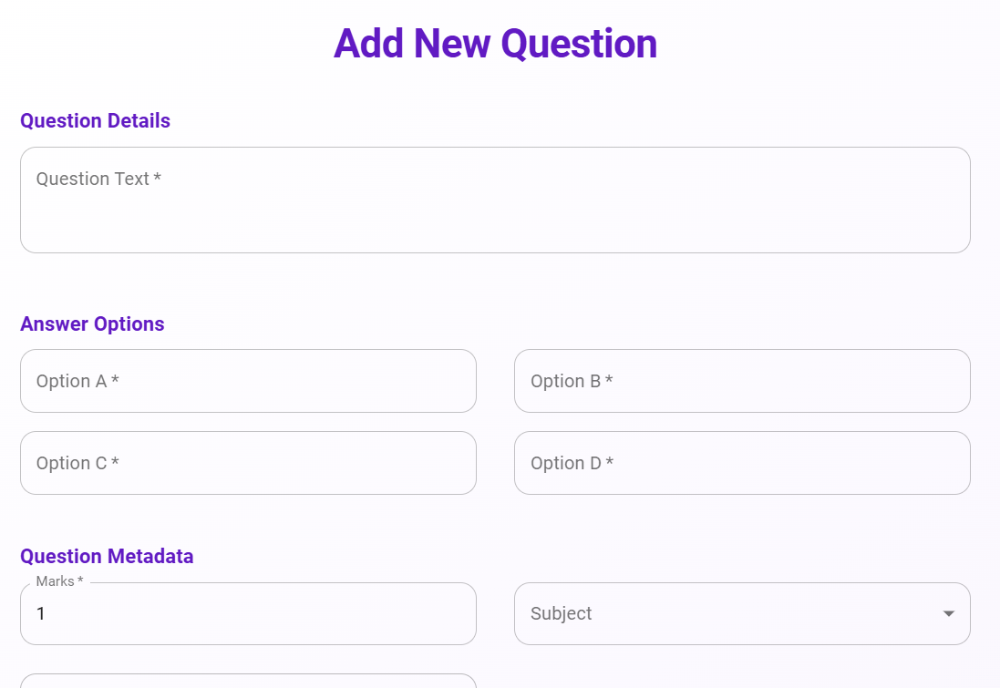

### Create Test

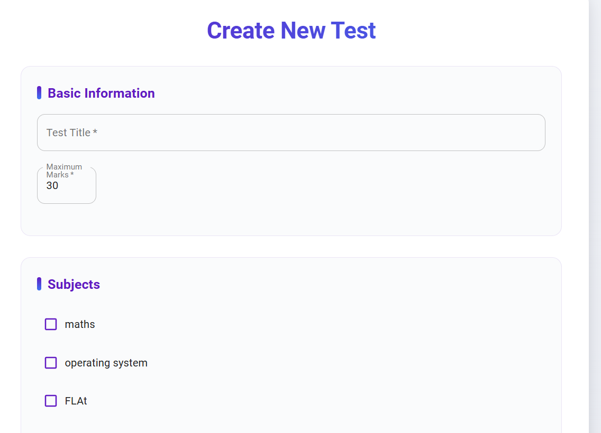

### Teacher Dashboard

### Student Registration

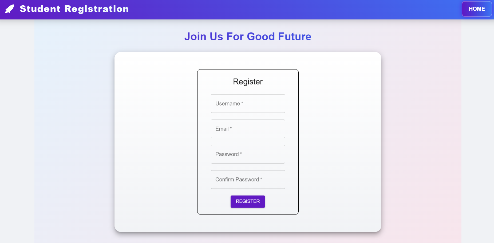

### Student Dashboard

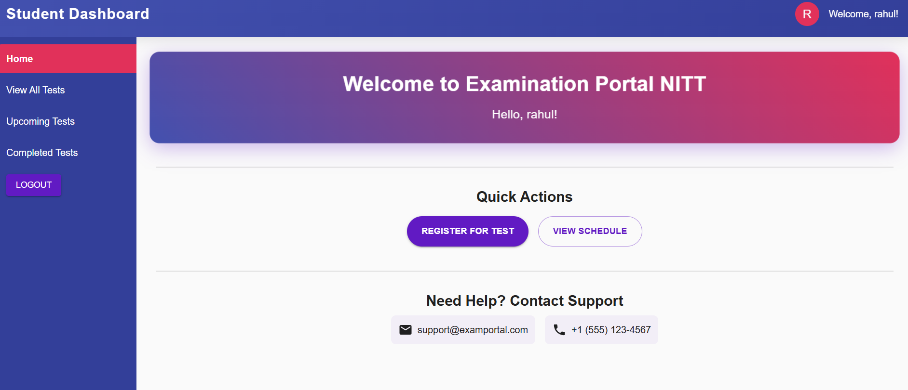

### View and Register for Test

### Test Live

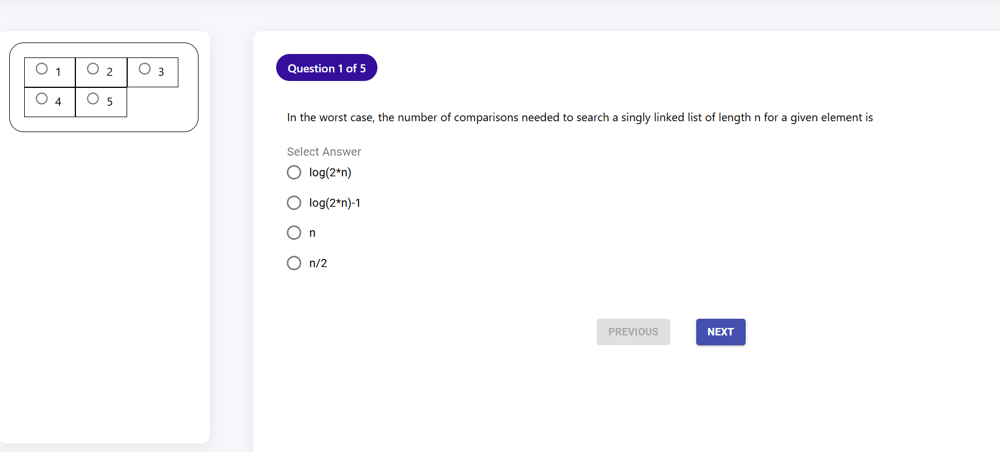

### Review Test

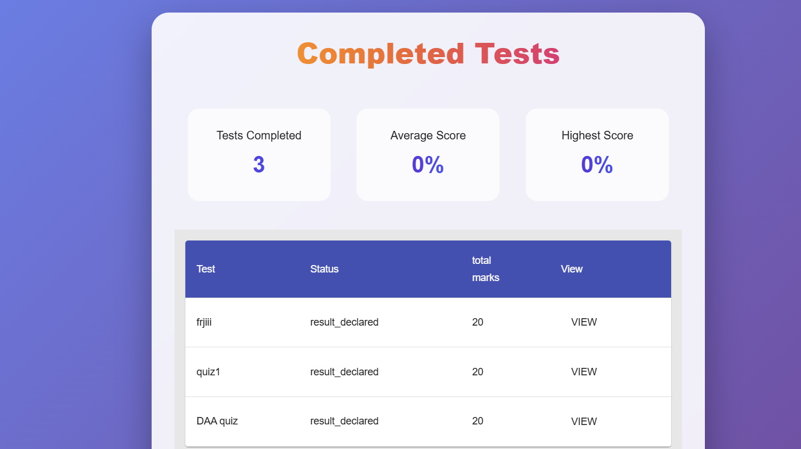

